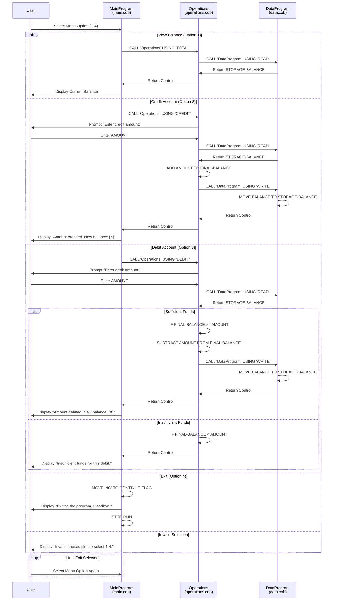

# Student Account Management System - COBOL Documentation

## Overview

This COBOL application implements a student account management system that handles basic financial operations on student accounts. The system follows a modular architecture with three distinct programs that work together to manage account balances.

---

## COBOL Program Documentation

### 1. **main.cob** - MainProgram (Entry Point)

#### Purpose
The main entry point for the Student Account Management System. Provides an interactive menu-driven interface for users to manage student accounts.

#### Key Functions
- **Menu Display**: Presents a user-friendly menu with four options for account operations
- **User Input**: Accepts numeric choices (1-4) from the user
- **Operation Routing**: Routes user selections to the appropriate operations module
- **Program Control**: Manages the main application loop until user chooses to exit

#### Business Logic
- The program runs in a continuous loop until the user selects option 4 (Exit)
- Each valid selection (1-3) triggers a call to the Operations module with a specific operation code
- Invalid selections display an error message and prompt the user to try again

#### Menu Options
1. **View Balance** - Displays the current student account balance
2. **Credit Account** - Adds funds to a student account
3. **Debit Account** - Removes funds from a student account
4. **Exit** - Terminates the application

#### Data Variables
- `USER-CHOICE`: Numeric value (0-9) capturing user's menu selection
- `CONTINUE-FLAG`: Boolean flag ('YES'/'NO') controlling the main loop

---

### 2. **operations.cob** - Operations (Business Logic)

#### Purpose
Handles the core business logic for account operations. This module executes the actual credit, debit, and balance inquiry transactions.

#### Key Functions
- **Balance Inquiry**: Retrieves and displays the current student account balance
- **Credit Transaction**: Adds a specified amount to the student account balance
- **Debit Transaction**: Subtracts a specified amount from the student account balance with validation
- **Data Coordination**: Communicates with the DataProgram module to read and write balance data

#### Business Rules - Student Account Management

##### Balance Inquiry (TOTAL)
- Retrieves the current balance from persistent storage
- Displays the balance to the user
- No validation required; purely informational

##### Credit Operation (CREDIT)
- Prompts the user to enter the credit amount
- Retrieves the current balance from storage
- Adds the credit amount to the existing balance
- Writes the updated balance back to storage
- Displays the new balance to the user
- **Rule**: All credit amounts must be accepted without maximum limit restrictions

##### Debit Operation (DEBIT)
- Prompts the user to enter the debit amount
- Retrieves the current balance from storage
- **Validation Rule**: Debit amount cannot exceed the current balance
  - If funds are sufficient: Subtracts the amount and updates storage
  - If insufficient funds: Rejects the transaction and displays error message
- Displays the new balance (or error message if transaction failed)

#### Initial Balance
- All student accounts initialize with a default balance of $1000.00

#### Data Variables
- `OPERATION-TYPE`: Code indicating the type of operation ('TOTAL ', 'CREDIT', or 'DEBIT ')
- `AMOUNT`: Numeric input capturing transaction amount (up to 999999.99)
- `FINAL-BALANCE`: Current account balance (up to 999999.99)
- `PASSED-OPERATION`: Parameter received from calling program

#### Call Interface
```
CALL 'Operations' USING <operation-code>
```
Where `<operation-code>` is one of: 'TOTAL ', 'CREDIT', 'DEBIT '

---

### 3. **data.cob** - DataProgram (Data Persistence)

#### Purpose
Manages data persistence for student account balances. This module serves as the data access layer, providing read and write operations for account information.

#### Key Functions
- **Read Balance**: Retrieves the current student account balance from storage
- **Write Balance**: Persists updated account balance to storage

#### Business Rules
- Maintains a single student account balance in memory
- Default initial balance: $1000.00
- All write operations overwrite the previous balance completely
- Currently implements in-memory storage (non-persistent across program runs)

#### Data Storage Model
- Single working storage area: `STORAGE-BALANCE`
- Represents one student account with a balance in currency format (6 digits, 2 decimal places)
- Current implementation stores data in program memory only

#### Call Interface
```
CALL 'DataProgram' USING <operation>, <balance>
```

Where:
- `<operation>`: Either 'READ' or 'WRITE'
- `<balance>`: The balance value to read into or write from

#### Data Variables
- `STORAGE-BALANCE`: In-memory storage for the current account balance
- `OPERATION-TYPE`: Indicates read or write operation
- `PASSED-OPERATION`: Parameter indicating operation type
- `BALANCE`: Parameter for exchanging balance data with calling program

---

## System Architecture

### Module Interaction Flow

```
MainProgram (main.cob)
    ↓
    User Input → Menu Selection
    ↓
    ├─→ 'TOTAL' operation
    │     ↓
    │   Operations (operations.cob)
    │     ↓
    │   DataProgram (data.cob) [READ]
    │     ↓
    │   Display Balance
    │
    ├─→ 'CREDIT' operation
    │     ↓
    │   Operations (operations.cob)
    │     ↓
    │   DataProgram (data.cob) [READ] → ADD → [WRITE]
    │     ↓
    │   Display New Balance
    │
    ├─→ 'DEBIT' operation
    │     ↓
    │   Operations (operations.cob)
    │     ↓
    │   Validate Funds
    │     ↓
    │   DataProgram (data.cob) [READ] → SUBTRACT → [WRITE]
    │     ↓
    │   Display New Balance or Error
    │
    └─→ 'EXIT'
          ↓
       Program Termination
```

---

## Data Flow

### Credit Operation Flow
1. User enters 'CREDIT' (option 2)
2. Operations module requests user to enter credit amount
3. Operations reads current balance from DataProgram
4. Operations calculates: `NEW_BALANCE = CURRENT_BALANCE + AMOUNT`
5. Operations writes new balance to DataProgram
6. System displays updated balance to user

### Debit Operation Flow
1. User enters 'DEBIT' (option 3)
2. Operations module requests user to enter debit amount
3. Operations reads current balance from DataProgram
4. **Validation**: IF `CURRENT_BALANCE >= DEBIT_AMOUNT` THEN
   - Calculate: `NEW_BALANCE = CURRENT_BALANCE - AMOUNT`
   - Write new balance to DataProgram
   - Display success message with new balance
5. **ELSE**:
   - Display insufficient funds error
   - Balance remains unchanged

---

## Business Rules Summary

| Rule | Details |
|------|---------|
| **Initial Balance** | All accounts start with $1000.00 |
| **Credit Limit** | No maximum limit on credits |
| **Debit Validation** | Cannot exceed current balance |
| **Precision** | Balances stored and displayed as currency (2 decimal places) |
| **Persistence** | Current implementation: In-memory only (non-persistent) |
| **Account Management** | System manages a single student account |
| **Transaction Logging** | No transaction history maintained |
| **Overdraft Protection** | System prevents negative balances through debit validation |

---

## Current Limitations & Future Enhancements

### Current Limitations
1. **Single Account**: System manages only one student account
2. **No Persistence**: Balance data is not persisted to disk; lost when program exits
3. **No Authentication**: No user authentication or account identification
4. **No Transaction History**: No audit trail or transaction log
5. **Limited Error Handling**: Minimal error messages for edge cases
6. **Fixed Balance Format**: Uses fixed-point decimal representation (may cause rounding issues in complex calculations)

### Recommended Enhancements
1. **Multi-Account Support**: Extend to support multiple student accounts with account IDs
2. **Database Integration**: Store balance data in a persistent database (SQL, file-based, etc.)
3. **Authentication**: Add student ID and password/PIN authentication
4. **Transaction Logging**: Maintain audit trail of all transactions
5. **Input Validation**: Add robust input validation for amounts and user choices
6. **Interest Calculations**: Support interest accrual on account balances
7. **Error Handling**: Implement comprehensive error handling and logging
8. **Reporting**: Add functionality to generate account statements and reports

---

## Technical Notes

- **Language**: COBOL
- **Architecture**: Modular 3-tier design (Presentation → Business Logic → Data Access)
- **Communication**: Inter-program communication via CALL statements with USING parameters
- **Data Format**: Fixed-length numeric fields with implicit decimal points

---

## System Sequence Diagrams

### Complete Application Data Flow

The following sequence diagram illustrates the complete interaction flow between all system components for the three main operations (Balance Inquiry, Credit, and Debit):



### Key Data Flow Observations

1. **Synchronous Communication**: All inter-program calls use COBOL's CALL statement with immediate return of control
2. **Parameter Passing**: Operations passes operation codes ('TOTAL ', 'CREDIT', 'DEBIT ') and data values via USING parameters
3. **Balance Management**: All balance reads and writes flow through the DataProgram, ensuring centralized control
4. **Validation**: Debit transactions include client-side validation (Operations) before attempting to write new balance
5. **User Interaction**: Operations handles direct user input for transaction amounts; MainProgram handles menu selection
6. **Error Prevention**: Insufficient funds condition prevents invalid state transitions in the data layer

